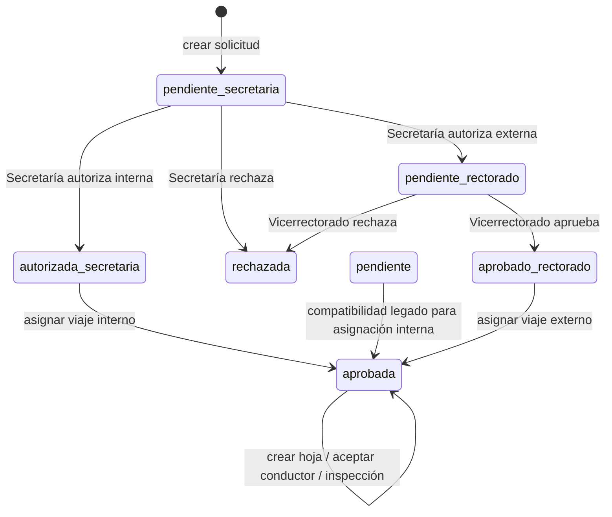
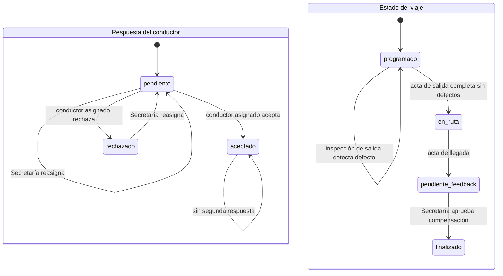
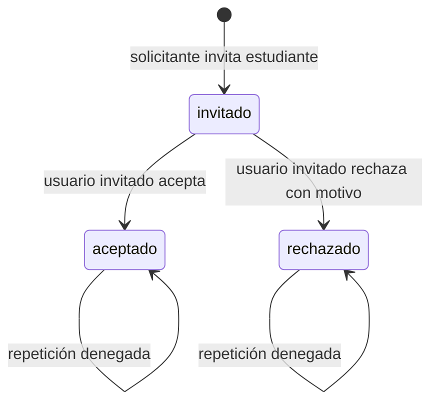
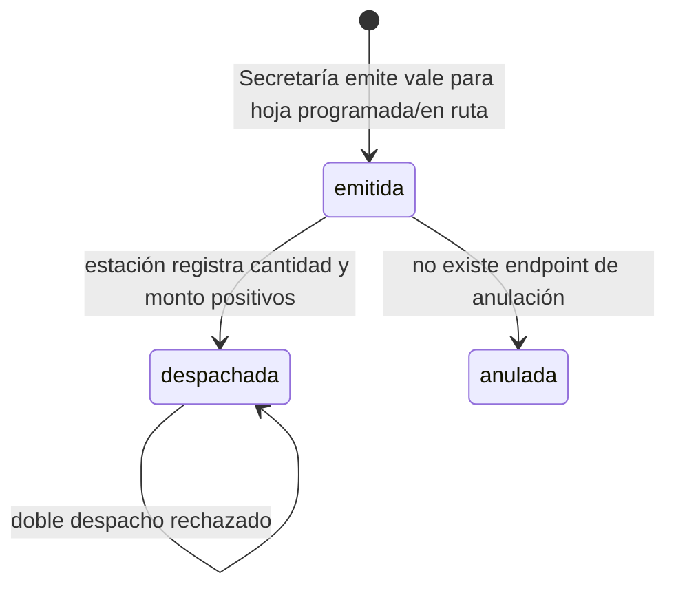
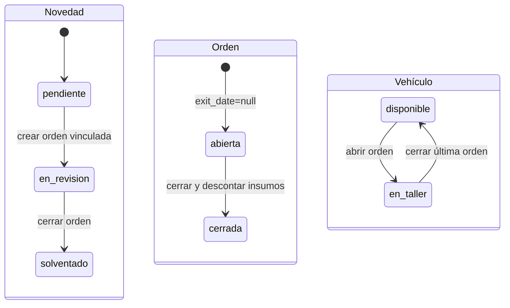
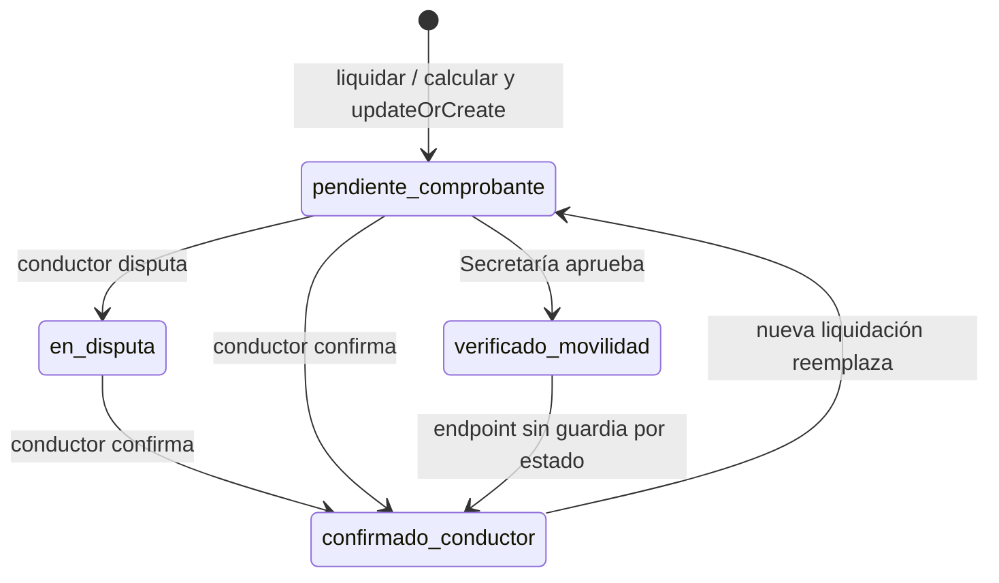
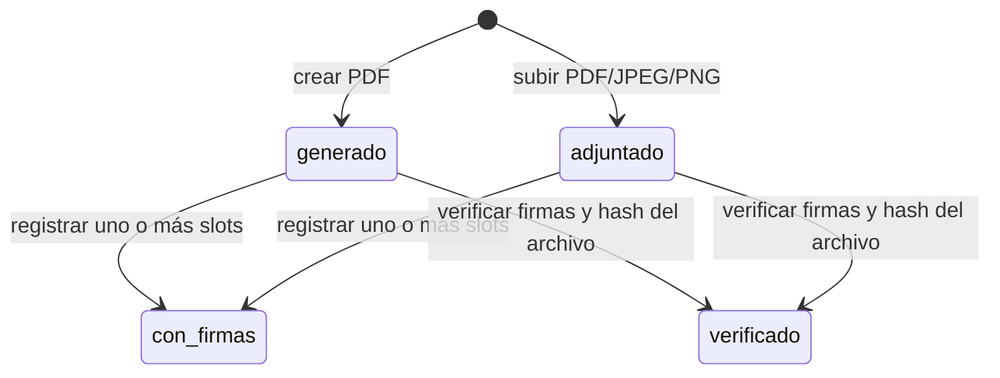

# Máquina de estados observada

Diagramas derivados de las acciones/controladores al cierre del 2026-09-29. Los tests de integración parciales se ejecutaron en PostgreSQL desechable (48/48 pasan); no todos los recorridos de estos diagramas tienen una prueba E2E completa. Las migraciones se aplicaron desde cero en otra base desechable.

## Solicitud y viaje

Las aprobaciones registran actor y cambio de estado en `request_status_histories`. La ruta de Vicerrectorado solo acepta `pendiente_rectorado`; la asignación exige Secretaría para viajes internos (con estado legado `pendiente` aún aceptado) y aprobación de Vicerrectorado para externos. No se implementa prohibición contra aprobar la propia solicitud. La asignación cambia la solicitud a `aprobada` y crea una hoja `trip_status=programado`, `driver_response=pendiente`. La aprobación financiera finaliza la hoja, pero no cambia el estado de `mobilization_requests`; no se encontró transición posterior de la solicitud a rechazada/finalizada.

## Asignación, inspección y viaje

Crear/reasignar hoja ocurre en transacción con bloqueos y validaciones de disponibilidad, licencia, mantenimiento y solapamiento horario de vehículo/conductor. Reasignar solo admite respuestas `pendiente` o `rechazado`. El rechazo no marca conductor/vehículo como ocupados; aceptación sí marca conductor no disponible y vehículo `en_viaje`. No hay capacidad de plazas en vehículo.

La salida exige hoja programada con conductor aceptado. Si el checklist tiene `MALO`, queda programada y aceptada, el vehículo pasa a `en_taller` y se crea una novedad. Ahora el taller puede abrir orden solo para esa hoja programada/en taller si la novedad enlazada corresponde al mismo vehículo; una hoja en ruta o cualquier otra asignación activa sigue bloqueando la orden. Al cerrar el trabajo, el vehículo vuelve a disponible y la hoja puede repetir inspección de salida. Esta recuperación tiene test de regresión en `DemoAccountsAndWorkflowTest`, pero no pudo ejecutarse por el driver DB ausente.

Una llegada válida requiere `en_ruta` y conductor aceptado, registra una sola acta, valida kilometraje frente a salida/vehículo y mueve la hoja a `pendiente_feedback`; libera vehículo, pero el conductor se libera al aprobar compensación. El endpoint especializado de llegada registra kilometraje/combustible con una observación fija y no exige el checklist de salida. Evaluar no cierra la hoja: el cierre ocurre al aprobar la compensación.

## Invitación de participante

Solo el usuario de la invitación puede responder. La evaluación es un proceso separado y exige invitación aceptada y hoja `pendiente_feedback`. `firstOrCreate` evita duplicado secuencial, pero falta índice único compuesto y el endpoint no valida cierre/capacidad de pasajeros. Capacidad no existe en el vehículo.

## Orden de combustible

Emisión y despacho usan transacciones/bloqueos y solo permiten un vale por hoja durante ejecución serializada. El vale se puede emitir antes de que el conductor acepte (`trip_status=programado`, respuesta pendiente). El cálculo usa distancias fijas por nombre de destino y fallback de 150 km, rendimiento constante y `float`; no se actualiza `consumed_liters` porque el despacho usa galones y la periodicidad/unidad no está definida.

## Novedad y orden de taller

La orden no tiene columna de estado: abierto/cerrado se infiere por `exit_date`. Crear orden pone vehículo `en_taller`; el cierre bloquea orden/vehículo/insumos, descuenta stock, resuelve novedad y libera el vehículo si no hay otra orden abierta. Si es cambio de aceite, programa el próximo intervalo desde el kilometraje actual.

## Compensación/liquidación

Es una tabla/proceso (`driver_compensations`) con endpoints separados de calcular, liquidar, aprobar y confirmar/disputar; no se encontró otra entidad “liquidación”. Secretaría puede calcular, registrar y aprobar, y no se guarda el actor de cada etapa. La misma persona puede calcular/aprobar. La fórmula pasa por `float`, con tarifas por defecto; no hay regla de redondeo financiera explícita. El conductor confirma solo su hoja; el endpoint no limita las transiciones por estado, por eso el código permite confirmar después de la disputa/aprobación y una liquidación posterior puede reabrir. Al aprobar, la hoja de ruta pasa a `finalizado` y se liberan conductor y vehículo; el registro de solicitud permanece `aprobada`.

## Documento

No hay estado documental persistido: se deriva de `source`, `document_signatures` y hash. Adjuntos usan nombre UUID, límite 10 por entidad, MIME detectado PDF/JPEG/PNG y máximo 10 MB. Se guarda SHA-256 y verificar compara el archivo existente. El payload de firma incluye el hash; se usa Ed25519 con Sodium si la extensión está disponible y, si no, HMAC con `APP_KEY`. Es un registro de firma de aplicación almacenado en BD, no una firma digital embebida/certificada del PDF ni una garantía de no repudio. En el runtime de esta auditoría Sodium no está disponible.
