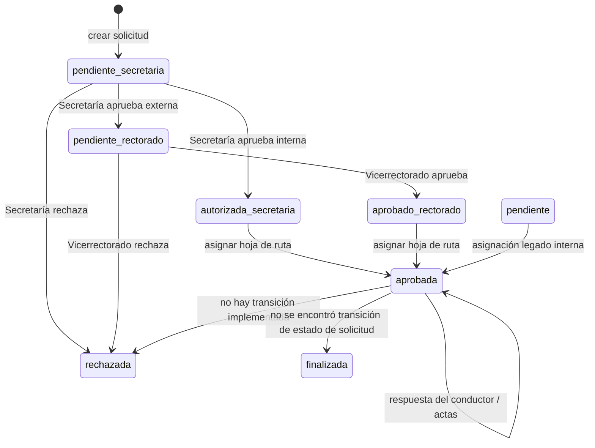
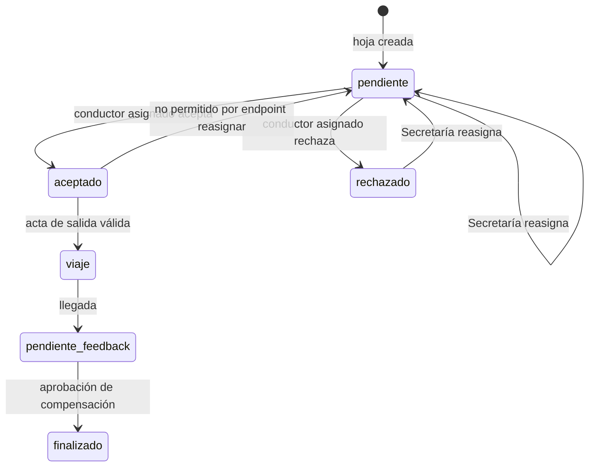
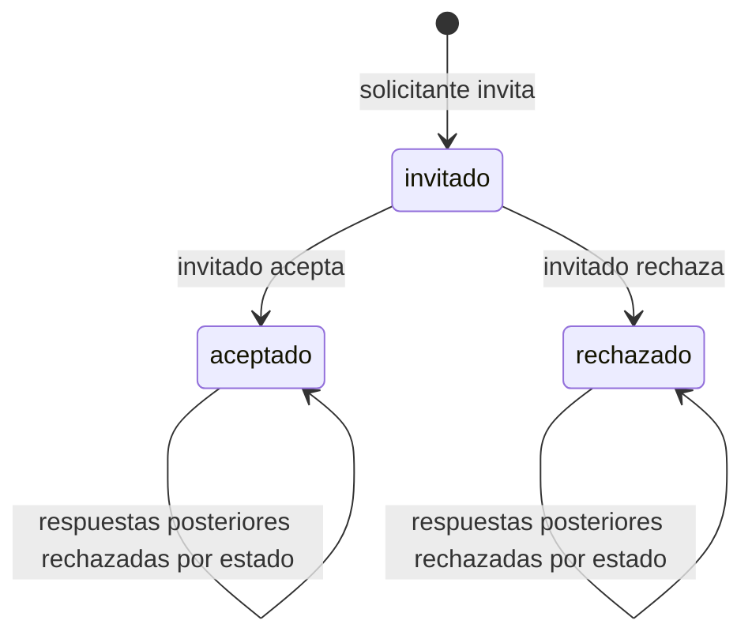
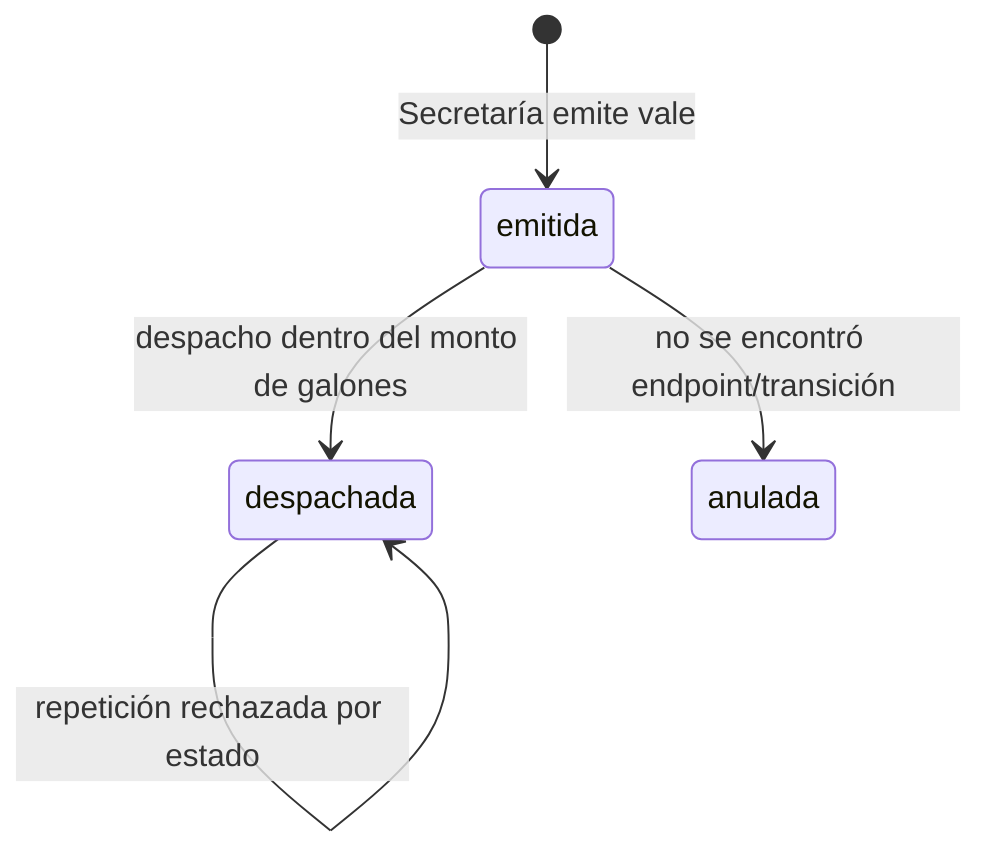
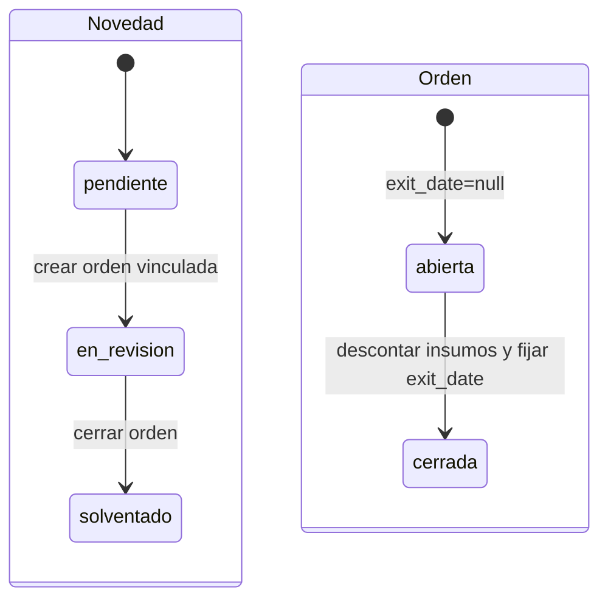
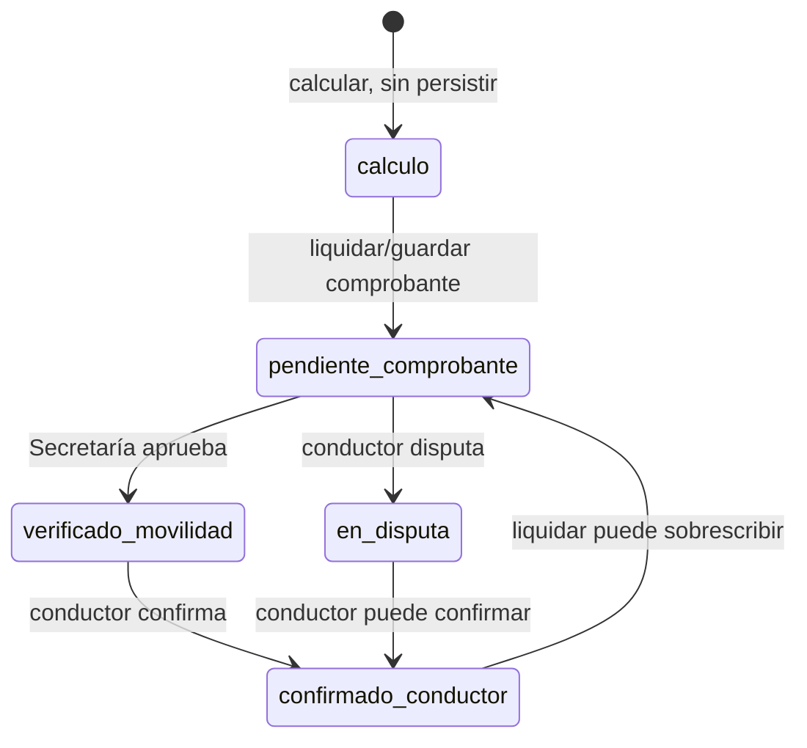
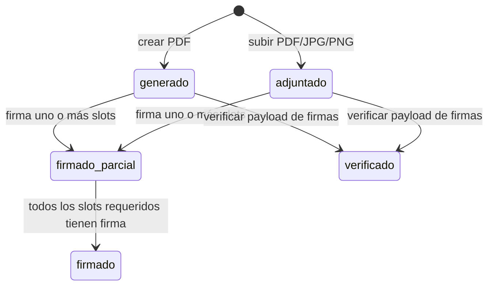

# Máquina de estados observada

Diagramas derivados de controladores/acciones actuales. Reflejan caminos implementados, incluidos estados sin transición; no prueban funcionamiento de extremo a extremo.

## Solicitud y viaje

La hoja de ruta nace como `trip_status=programado`, `driver_response=pendiente`. Aceptar pone `driver_response=aceptado`, conductor no disponible y vehículo `en_viaje`; rechazar marca `rechazado`. Secretaría puede reasignar si la respuesta es `rechazado` o `pendiente`, reiniciándola a pendiente. Un acta de salida sin fallas pasa a `en_ruta`; con fallas marca vehículo `en_taller` y crea novedad, pero mantiene la hoja `programado`. Acta de llegada pasa a `pendiente_feedback`; el vehículo se libera. La aprobación financiera cambia la hoja a `finalizado` y libera conductor/vehículo. La evaluación por sí sola no finaliza la hoja. La solicitud externa requiere Secretaría y luego Vicerrectorado (`AutorizarSecretariaController`, `AprobarRectoradoController`, tests existentes).

## Asignación y respuesta del conductor

No hay reserva transaccional ni comparación de intervalos de vehículo/conductor al crear o reasignar. La API permite comprobar banderas de disponibilidad, no cruces de horario ni capacidad de pasajeros.

## Invitación de participante

El endpoint verifica que quien responde sea el usuario invitado. No verifica estado/cierre de solicitud ni plazas disponibles al responder. La base no tiene índice único solicitud/usuario.

## Orden de combustible

## Novedad y orden de taller

La orden no tiene campo de estado; abierta/cerrada se infiere de `exit_date`. Crear orden no marca el vehículo `en_taller`; cerrar lo marca `disponible`.

## Compensación/liquidación

La tabla `driver_compensations` soporta un registro por hoja; por lo implementado es un flujo denominado compensación/liquidación. Secretaría calcula, registra comprobante y aprueba; el conductor confirma o disputa. No se persiste quién calculó ni quién aprobó. No se impide que el mismo usuario haga varios pasos.

## Documento

No hay estado documental persistido: el estado mostrado se deriva de `source` y las filas de firma. La verificación no recalcula el hash del archivo actual, por lo que el diagrama “verificado” describe solo la firma del payload almacenado.
